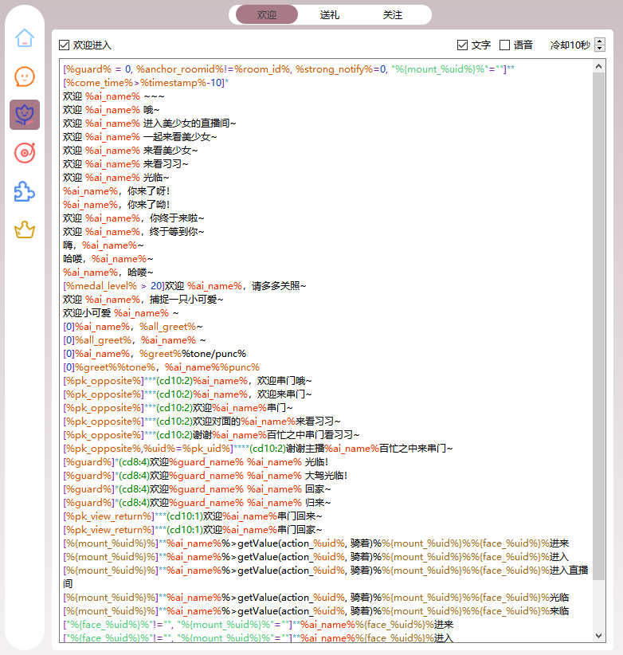
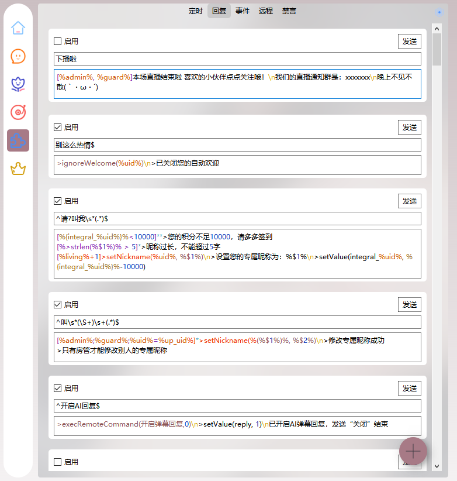
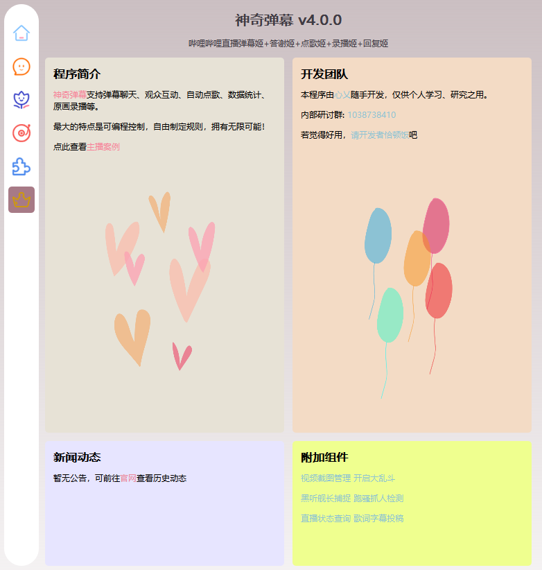
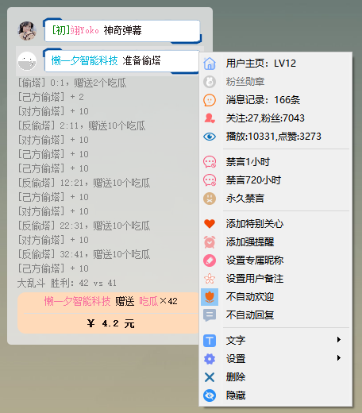

[toc]

神奇弹幕
===

## 介绍

一个Bilibili直播弹幕姬+答谢姬+点歌姬+录播姬+回复姬。

支持弹幕聊天、观众互动、自动点歌、数据统计、原画录播等。

最大的特点是可编程控制，自由制定规则，拥有无限可能！

QQ群：**1038738410**，欢迎大家一起交流反馈与研究新功能~


## 神奇

神奇在何处？哦，也就下面这些：

- 根据观众自身数据（时间、等级、勋章等），按条件智能欢迎/答谢
- 外语自动翻译、AI闲聊回复、生僻字读音等自动化功能
- 粉丝变化、热门榜、大乱斗、船员变化、新人发言等种种数据
- 大乱斗查看双方串门的粉丝、同步视频PK对面消息、跑骚抓人
- 上船私信、感谢分享、最佳助攻、弹幕打卡回复等
- 点歌姬音源包含网易云/QQ/咪咕音乐，支持会员歌曲
- 全自动点歌、弹幕切歌、自动暂停其它音乐、排队时长提示
- 完全无人值守，远程控制，开播QQ群播报、自动录播
- 播放各音乐平台会员歌曲，没有版权的歌曲自动更换播放源
- 单个粉丝设置特别关心、强制提醒、专属昵称、永久禁言等
- 查看每名观众进来次数、礼物总计、弹幕记录、判断机器人等
- 小窗闲聊、迷你视频、快速截图，上班摸鱼挂后台听直播必备
- 自动签到、参与天选、领取小心心、赠送到期礼物
- 大量可编程运算、网页访问，超高自由度的弹幕机器人
- 支持小游戏，比如扣1禁言、关注解禁、送礼物优先点歌等
- 更多神奇的隐藏功能，以及可编程扩展功能


## 弹幕

### 答谢姬

- 自动欢迎进入
- 自动感谢送礼
- 实时感谢关注
- 冷却避免刷屏
- 合并礼物连击
- 设置礼物别名
- 智能昵称简化
- 目标强制欢迎
- 舰长单独欢迎
- 自动语音播报
- 个人专属昵称
- 开播下播提醒
- 可编程变量集
- 动态条件运算
- 黑白名单筛选
- 支持远程控制
- 支持语音朗读
- 礼物总结答谢
- 答谢分享直播间
- 答谢PK最佳助攻
- PK对面信息播报
- PK在线舰长播报


### 弹幕姬

- 实时显示弹幕
- 小窗弹幕聊天
- 定时弹幕任务
- 简约聊天模式
- 点歌自动复制
- 查看点歌历史
- 保存弹幕历史
- 每日数据统计
- 外语自动翻译
- 智能沙雕回复
- 特别关心高亮
- 查看粉丝牌子
- 查看礼物价值
- 查看昵称拼音
- 粉丝变化提示
- 房管一键禁言
- 新人发言提示
- 弹幕自由复制
- 定时连接后台
- 喷子自动拉黑
- 新人快速禁言
- 跳转用户主页
- 用户累计数据
- 用户弹幕历史
- 吃瓜自动偷塔
- 大乱斗反偷塔
- PK 历史次数
- PK 偷塔概率
- 快速百度搜索
- 大乱斗的串门
- 对面消息同步
- 机器小号判断
- 弹幕语音朗读
- 支持讯飞语音
- 支持语音接口
- 弹幕全屏滚动
- 背景图片轮播
- 自动切换勋章
- 发送对面弹幕
- 显示船员数量
- 屏蔽用户进入
- 实时人气查看
- 每日平均人气


### 点歌姬

- 音源自动切换
- 播放会员歌曲
- 点歌自动播放
- 智能分析歌名
- 暂停其余音乐
- 点歌历史记录
- 自由显示格式
- 自动点歌队列
- 点歌防止刷屏
- 预计时长回复
- 支持弹幕切歌
- 送礼立即播放
- 背景封面模糊
- 提取主题色调
- 查看桌面歌词
- 收藏夹与历史
- 一键导入歌单


### 录播姬

- 自动开始录播
- 分割文件大小
- 断联自动重录


### 回复姬

- 自定义关键词
- 筛选用户条件
- 多条随机回复
- 支持编程变量
- 数量不做限制
- 用户弹幕打卡
- 远程控制程序
- 修改专属昵称


### 视频流

- 匿名查看直播
- 预先连续截图
- 预览PK对面
- 避免PK黑屏
- 自动调整比例

### 截图制作

- 快速预先截图
- 多图片管理器
- 好图一键提取
- 截图批量裁剪
- 分解GIF动图
- 制作GIF动图
- 制作AVI视频
- 制作字符画图

### 服务端

- 直播姬可访问
- 无限扩展可能
- 支持B站接口


### 其他

- 开启大乱斗
- 配置导入导出
- 投稿歌词字幕
- 自动切换勋章
- 每日自动签到
- 自动参与天选
- 赠送到期礼物
- 直播状态查询
- 直播匿名跑骚
- 捕捉黑听舰长


## 运行与升级

### 运行

绿色版，免安装，双击`神奇弹幕.exe`打开。

退出从屏幕**右下角托盘的右键菜单**中退出。

### 升级

下载新版的**zip文件**，解压后将里面的文件复制，**覆盖**旧版的文件。

### 备份

复制整个安装文件夹即可，支持任意多开。


## 预览截图













## 使用技巧

绿色版，开箱即用，输入房间号自动连接。

### 实时弹幕

实时弹幕支持如同聊天软件的水群小窗，`Shift+Alt+D`快速弹出（非隐藏时有效），ESC返回之前的程序。

若是上班摸鱼，可以设置闲聊模式（仅显示弹幕）+简约模式（去头像、彩色），背景全透明，文字半透明灰色，不注意绝对很难看出来。


### 设置账号Cookie

如果要发送弹幕，必须登录账号。目前有**二维码登录**和**手动设置Cookie**两种方式。

**方式一：二维码登录**

直接点开菜单中的“账号——二维码登录”，使用哔哩哔哩APP扫码确认。

**方式二：使用浏览器Cookie登录**

1. 浏览器上按`F12`打开【开发者工具】，Network - XHR
2. 进入或刷新[B站主页](https://www.bilibili.com/)（没登录的需登录），Name多了一排，点其中任意一个（若找不到Cookie就换个）
3. 复制如下图的cookie至菜单“账号”中的“设置Cookie”，即可进行发送。


使用Cookie也是为了保证账号安全，当程序借给别人时，自己可以远程退出Bilibili账号，所有登录失效。之后则需要重新设置cookie。

> 如果输入房间号后一直显示“获取房间信息...”，需先安装VC_redist：https://aka.ms/vs/15/release/vc_redist.x64.exe


### 欢迎弹幕

以下多项功能支持自定义弹幕、大量可编程变量，具体说明请参考下面的“[可编程变量与运算](#programing)”。

- 普通的欢迎：`%ai_name%，%greet%%tone/punc%`
  将发送：某某某，早上好啊~

- 欢迎**舰长**：`[%guard%]*欢迎%guard_name% %ai_name% 回家~`
- ~~一周至一个月没来~~：`[%come_time%>%timestamp%-3600*24*30, %come_time%<%timestamp%-3600*24*7, 0]*%ai_name%，太久没来了哦~`

  > v3.5.7修改：为了保证运行效率，一周没有进入直播间的用户记录将自动清除
- **大乱斗对面**来人：`[%pk_opposite%]***欢迎%ai_name%串门哦~`


##### 示例：只欢迎戴自己勋章

未戴粉丝勋章或者不是本直播间粉丝勋章的用户，不自动欢迎；除非是舰长或设置为强提醒：

```
[%guard% = 0, %anchor_room_id%!=%room_id%, !%strong_notify%]**
```

两个`*`表示优先级，覆盖没有`*`或1个`*`的弹幕，空弹幕表示不发送。


##### 示例：指定用户欢迎语

指定某一用户的进场通知：

```
[%uid%=12345678]***欢迎%ai_name%，说好的今天上总督呢~
[%uname%=用户昵称]***欢迎%ai_name%，今天记得上总督哦~
```

推荐使用UID的方式，不会变更；临时用可用uname。

其中表示优先级的`*`数量务必要比其余弹幕多。


### 送礼答谢

- 普通的答谢：`谢谢 %ai_name% 的%gift_name%~`
- **小礼物**不理：`[%gift_gold%=0, %gift_silver%<1000, %gift_num% < 10]**`
  也可以写作：`[%coin_type%=0, %gift_coin%<1000, %gift_num% < 10]**`
  1000以下的银瓜子礼物且数量小于10，则忽略。例如忽略6个小心心，但24个小心心则感谢
- **超过80元**的礼物：`[%gift_gold%>=80000]*哇噢！感谢 %ai_name% 的%gift_name%！\n老板大气！！！！！！`
  `\n`表示换行，将分作两条弹幕发送（可以配合`<h1>`放大字体，仅部分弹幕插件有效）
- **跳过机器人送的吃瓜**：`[%uid%=%my_uid%,%origin_gift_name%=吃瓜]**`


##### 示例：指定礼物专属答谢

赠送小电视飞船，发送指定弹幕：

```
[%gift_name%=小电视飞船]**哇！！！谢谢%ai_name%带大家上太空~
```


##### 示例：不答谢禁言用户

提升优先级，空弹幕，即屏蔽。

```
[%blocked%]****
```


### 关注答谢

##### 示例：特别关注

```
[%special%]*(cd21:0)谢谢%ai_name%的特别关注！
感谢 %ai_name% 的关注%punc%
```

> 测试时不答谢关注的一个重要原因，是因为刚取消关注就重新关注了，短期内不会答谢！


### 定时任务

定时发送随机弹幕、执行命令。


##### 示例：今日是否有大航海

```
[%today_guard%=0]今天XX等到新的舰长了吗？\n老板们救救可怜的XX吧~
[%today_guard%>0]今天XX等到了新的舰长，还有老板想上船嘛
```

> 今天的相关数据都需要在程序连接房间时才有效


##### 示例：定时联网

如果想要定时向某个API发送数据，可通过定时任务结合`connectNet(url)`命令

```
>connectNet(要发送数据的网址)
```


### 自动回复

接收到某个关键词，发送对应的回复。

关键词支持正则表达式，使用`%$x%`来获取匹配到的文本，其中`x`为索引，`%$0%`为接收的整条弹幕，`%$1%`为捕获的第一对括号中的文字，`%$2%`为第二对，下同。


##### 示例：关键词自动禁言

> 有专门的禁言选项卡，此示例仅仅是展示使用方式

添加需要禁言关键词`xxx`，支持正则表达式。设置回复：

```
>block(%uid%)
```


##### 示例：房管远程弹幕禁言

默认仅主播与机器人账号支持弹幕禁言，此方法可提升至房管（或其他特定条件用户）：

添加回复：`^((禁言|解禁|解除禁言|取消禁言) .+|撤销禁言)$`，添加动作：

```
[%admin%]>execRemoteCommand(%text%)
```


##### 示例：不要欢迎我

添加表达式：`别这么热情`，添加回复：

```
>ignoreWelcome(%uid%)\n>已关闭您的自动欢迎
```

只要弹幕中包含“别这么热情”，则以后都不会自动欢迎


##### 示例：设置自己专属昵称

添加自动回复表达式：`^请?叫我\s*(.*)$`，添加回复：

```
>setNickname(%uid%, %$1%)\n>设置您的专属昵称为：%$1%
```

当用户发送弹幕：“叫我 小明”或“请叫我小明”，程序自动设置其专属昵称为“小明”。


##### 示例：修改指定用户昵称

添加自动回复表达式：`叫(\S+)\s+(.*)`，添加回复：

```
[%admin%]>setNickname(%(%$1%)%, %$2%)\n>修改专属昵称成功
```


### 浏览器插件

开启“远程—网络服务”，之后于直播姬中添加浏览器并访问网址，即可打开插件页面，无缝嵌入直播界面。

网址为：`http://localhost:5520` + 路径。

目前支持以下功能：

| 说明                 | 路径                  |
| -------------------- | --------------------- |
| 点歌列表             | /music/index.html     |
| 正在播放的歌曲       | /music/playing.html   |
| 正在播放的歌曲的歌词 | /music/lyrics.html    |
| 送礼物小动画         | /gift/index.html      |
| 电影结束效果答谢     | /gift/end_thanks.html |

更多功能可自行定制，接口与开发文档见底部“[Web开发接口](#web_dev)”。


### 远程控制

主播或者机器人账号在直播间内发送如`关闭欢迎`、`开启录播`等命令，可远程控制在服务器上的机器人（本地没必要使用远程命令）。

- 关闭/开启功能：开关自动欢迎、送礼答谢、关注答谢、自动禁言
- 关闭/开启欢迎
- 关闭/开启关注答谢
- 关闭/开启送礼答谢
- 关闭/开启禁言：新人关键词自动禁言
- 关闭/开启偷塔
- 关闭/开启点歌
- 关闭/开启点歌回复
- 关闭/开启定时任务
- 关闭/开启自动连接
- 关闭/开启AI回复：AI回复弹幕
- 关闭/开启录播
- **禁言 [昵称] [小时]**：房管权限，根据[昵称]（允许一部分，自动倒找发言人）禁言某用户，[小时]可省略，默认为自动禁言的时长（禁言相关都需要在设置中开启“**启用禁言（主播/房管）**”）
- 解禁 [昵称]：解除禁言，[昵称]支持用户名中的一部分
- **撤销禁言**：依次解禁最近禁言的用户
- 永久禁言 [昵称]：永久禁言某用户，可通过“解禁 [昵称]”、“撤销禁言”远程解除
- 关闭机器人：全局关闭（将无法远程唤醒）


### 弹幕样式

支持自定义实时弹幕的CSS样式，实时弹幕的右键菜单中，设置->标签样式。

**圆角矩形**

```css
background: white;
padding:5px;
border-radius: 10px;
```

**气泡图片**

```css
padding:10px;
border-image: url(:/bubbles/bubble1)
```

其中图片可使用本地绝对路径，例如：

```css
border-image: url(C:/Path/To/Image.png)
```

**类型选择**

支持按不同类型设置不同的样式，样式如下：

- msg：一些提示
- danmaku：弹幕（样式不影响左边头像显示）
- gift：送礼
- welcome：进入
- order-song：点歌提示文字：[点歌] 歌名
- guard-buy：开通/续费舰长
- welcome-guard：舰长进入
- attention：关注
- block：禁言
- share：分享直播间
- super-chat：醒目留言

以下是一个示例：

弹幕为默认气泡；礼物、上舰为圆角矩形卡片

```css
#danmaku {
    border-image: url(:/bubbles/bubble1);
    padding: 10px;
}
#gift, #guard-buy {
    background: #FFDAB9;
    padding: 5px;
    border-radius: 10px; 
}
```

<div id='programing'/>
---

## 可编程变量与运算

> 这一块比较专业，所以单独拎出来写教程。

弹幕的候选列表中，支持一系列的可编程变量、简单逻辑运算、简单算术运算。

使用两个 `%` 包括的英文，则为变量。数据变量例如 `%uname%`，与当前的一系列数据相关，例如礼物价值、今日人数等等；招呼变量例如 `%greet%`，自动替换为当前时间段对应的招呼语，例如候选项表达式 `%ai_name%，%greet%%tone/punc%`，在早上可能是“早上好啊，某某某”，在下午可能是“某某某，下午好~”，在晚上又会是“晚饭吃了吗，某某某~”。

示例：

- 简单的欢迎：`欢迎 %ai_name% 光临~`
- 动态语气词：`%ai_name%，%greet%%tone/punc%`

看下去，有更多例子。


### 计算变量

| 变量     | 描述                | 注意事项                               |
| -------- | ------------------- | -------------------------------------- |
| %{key}%  | 获取配置文件中的值  | key为setValue(key)中的键值，未设置为空 |
| %[exp]%  | 简单的数值计算      | 暂时只支持加减乘除，不支持括号、小数   |
| %(name)% | 将用户昵称转换为uid | 需要实时弹幕上显示才有效，允许部分昵称 |

`%{key}%` 如果是一个未设置的值，那么将会是空字符串，如果要转化为数字`0`，可以使用`%[%{key}%+0]%`的方式。


##### 示例：礼物价值

```
谢谢%ai_name%赠送了价值%[%gift_gold%/1000]%元的%gift_name%！
```


### 数据变量

同上，都需要带上百分号，例如 `%var%`，表格中皆省略。

目前已支持中文，可直接使用形如 `%用户ID%` 的格式。

| 变量             | 中文               | 说明                                                         |
| ---------------- | ------------------ | ------------------------------------------------------------ |
| uid              | 用户ID             | 是一串数字，确定唯一用户                                     |
| uname            | 用户昵称           | 需要用户值，例如定时消息，则只是空字符串                     |
| username         | 用户昵称           | 和上面一模一样                                               |
| nickname         | 用户昵称           | 同上                                                         |
| ai_name          | 用户智能昵称       | 优先专属昵称，其次简写昵称，无简写则用原昵称                 |
| local_name       | 用户专属昵称       | 实时弹幕中右键-设置专属昵称                                  |
| simple_name      | 用户简写昵称       | 去除前缀后缀各种字符                                         |
| csrf             |                    | 用户的csrf token                                             |
| level            | 用户等级           | 进入直播间没有level                                          |
| text             | 弹幕消息           | 几乎用不到                                                   |
| come_count       | 用户进入次数       |                                                              |
| come_time        | 用户上次进入时间   | 10位时间戳，第一次进来是0；自动清理一周没来的。如果是串门回来，则是刚跑到对面串门的时间 |
| come_time_delta  | 进入时间差         | 当前时间 - 用户上次进入时间                                  |
| gift_gold        | 礼物金瓜子         | 非送礼答谢则没有                                             |
| gift_silver      | 礼物银瓜子         |                                                              |
| gift_coin        | 礼物瓜子           | 不分金瓜子银瓜子                                             |
| coin_gold        | 是金瓜子礼物       | 金瓜子是1，银瓜子是0                                         |
| gift_name        | 礼物名字           | 如果设置了别名，则使用别名                                   |
| origin_gift_name | 礼物原始名字       | 未设置别名时等同于gift_name                                  |
| gift_num         | 礼物数量           |                                                              |
| gift_multi_num   | 带单位的礼物数量   | 如果为1个，则忽略，为空文本                                  |
| guard_buy        | 开通大航海         | 上船消息，gift_name：舰长/提督/总督；guard：3舰长/2提督/1总督 |
| guard_frist      | 初次上船           | 初次1，重新上船2，其余0                                      |
| total_gold       | 用户总共金瓜子     | 该用户一直以来赠送的所有金瓜子数量                           |
| total_silver     | 用户总共银瓜子     | 同上                                                         |
| anchor_room_id   | 粉丝勋章房间ID     | 进入、弹幕才有粉丝牌，送礼只能获取粉丝牌名字                 |
| medal_name       | 粉丝勋章名称       | 同上                                                         |
| medal_level      | 粉丝勋章等级       | 同上                                                         |
| medal_up         | 粉丝勋章主播昵称   | 只有弹幕消息有                                               |
| nickname_len     |                    | 用户昵称长度                                                 |
| giftname_len     |                    | 礼物名字长度                                                 |
| name_sum_len     |                    | 用户昵称长度+礼物名字长度                                    |
| ainame_sum_len   |                    | 用户短昵称长度+礼物名字长度                                  |
| new_attention    | 新关注             | 最近50个关注内                                               |
| guard_count      | 上船次数           | 舰长+1、提督+10、总督+100（只统计程序运行时），0为初次上船   |
| pking            | 大乱斗中           | 是：1，否：0                                                 |
| pk_video         | 视频大乱斗         | 是：1，否：0                                                 |
| pk_id            | 大乱斗编号         |                                                              |
| pk_room_id       | 对面房间号         | 未在PK中则为空，下同                                         |
| pk_uid           | 对面主播ID         |                                                              |
| pk_uname         | 对面主播昵称       |                                                              |
| pk_opposite      | 对面进入           | 需开启串门提示                                               |
| pk_view_return   | 去对面串门回来     | 需开启串门提示                                               |
| pk_count         | 匹配次数           | 未在PK中为0，下同                                            |
| pk_touta_prob    | 对面偷塔概率       | 百分比的数值部分，例如概率为50%，则为50。初次PK为0           |
| pk_my_votes      | 己方积分           |                                                              |
| pk_match_votes   | 对方积分           |                                                              |
| pk_ending        | 大乱斗尾声         | 快结束前2秒，根据设置中的大乱斗【提前】值判断                |
| pk_trans_gold    | 大乱斗积分转金瓜子 | pk的1分等于多少金瓜子                                        |
| pk_max_gold      | 大乱斗偷塔上限     | 单次偷塔赠送礼物的金瓜子数量上限                             |
| today_come       | 今日进入人次       | 每个人可能重复进入                                           |
| today_newbie_msg | 今日新人人数       |                                                              |
| today_danmaku    | 今日弹幕总数       |                                                              |
| today_fans       | 今日新增粉丝数     |                                                              |
| fans_count       | 总粉丝数           |                                                              |
| today_gold       | 今日金瓜子总数     |                                                              |
| today_silver     | 今日银瓜子总数     |                                                              |
| today_guard      | 今日上船人次       | 续多个月算多次                                               |
| today_max_ppl    | 今日最高人气       |                                                              |
| popularity       | 当前人气           |                                                              |
| admin            | 房管               | 只有弹幕、进入才有                                           |
| guard            | 大航海级别         | 只有弹幕消息/购买舰长/舰长进入有；普通0，舰长3，提督2，总督1 |
| guard_name       | 大航海身份         | “舰长”/“提督”/“总督”，非船员为空                             |
| admin_or_guard   | 是否是房管或舰长   | 只有弹幕消息有，0或1                                         |
| vip              | 姥爷               | 同上                                                         |
| svip             | 年费姥爷           | 同上                                                         |
| uidentity        | 正式会员           | 同上                                                         |
| iphone           | 手机号认证         | 同上                                                         |
| number           | 数量               | 各种数量的通用写法，如礼物数量等                             |
| time_hour        | 当前小时           |                                                              |
| time_minute      | 当前分钟           |                                                              |
| time_second      | 当前秒             |                                                              |
| time_day         | 当前日期           |                                                              |
| time_month       | 当前月份           |                                                              |
| time_year        | 当前年份           |                                                              |
| time_day_week    | 当前星期           | 1~7                                                          |
| time_day_year    | 今年第几天         |                                                              |
| timestamp        | 当前时间戳         | 10位时间戳，可用于比较进入时间、多久没来等                   |
| timestamp13      | 当前时间戳13       | 13位时间戳                                                   |
| in_game_users    | 在游戏用户中       | uid在gameUsers[0]中（高性能，但重启清空）                    |
| in_game_numbers  | 在游戏数值中       | uid在gameNumbers[0]中                                        |
| in_game_texts    | 在游戏文本中       | text在gameTexts[0]中，空格等都需要一模一样                   |
| app_path         | 程序目录           |                                                              |
| living           | 直播中             | 是：1，否：0                                                 |
| room_id          | 直播间ID           |                                                              |
| room_name        | 直播间标题         |                                                              |
| up_uid           | 主播ID             |                                                              |
| up_uname         | 主播名字           |                                                              |
| my_uid           | 机器人ID           |                                                              |
| my_uname         | 机器人名字         |                                                              |
| is_up            | 是主播             |                                                              |
| is_me            | 是机器人           |                                                              |
| is_room_medal    | 戴本勋章           | 戴本直播间的粉丝勋章                                         |
| care             | 特别关心           | 是：1，否：0                                                 |
| strong_notify    | 强提醒             | 是：1，否：0                                                 |
| not_welcome      | 不自动欢迎         | 不欢迎：1，欢迎：0                                           |
| not_reply        | 不自动回复         | 不回复：1，回复：0                                           |
| blocked          | 被禁言             | 禁言：1，未禁言0                                             |
| playing_song     | 当前歌曲           | 点歌姬没有播放歌曲则为空                                     |
| song_order_uname | 当前歌曲点歌者     | 同上                                                         |
| random100        | 随机100            | 1~100的随机数，同代码块中的都将随机替换为同一个数，可用于设置抽奖概率 |
|                  | 特别               | 关注答谢里可用，判断特别关注                                 |


#### 特殊用法

##### 打破“仅直播时发送”

仅在 **定时任务、自动回复、事件动作** 中有效，在开启“**仅直播时回复**”开关后，下播后所有自动弹幕都将不发送。

此时在需要发送的弹幕框中，其`任务/回复/动作`中带有`%living%`选项，则在非直播时也会激活。

例如自动回复的动作为：`[%living%+1]弹幕文字`，该回复不受直播状态影响。

> 如果开启了“定时连接B站服务器”，那么超出时间段下播后神奇弹幕不会接收所有弹幕，所有功能暂停。


##### 自定义bilibili接口

`%csrf%`为用户cookie，用于连接B站的API，结合本程序的`connectNet`(GET)、`postData`(POST)，向服务器发送指定数据。


### 招呼变量

| 变量      | 描述           | 示例                                              |
| --------- | -------------- | ------------------------------------------------- |
| hour      | 时辰           | 早上/中午/下午/晚上                               |
| greet     | 招呼           | 您好、早上好、晚上好                              |
| all_greet | 带语气词的招呼 | 你好、早上好啊、午饭吃了吗、晚上好呀、怎么还没睡~ |
| tone      | 语气词         | “啊”或“呀”                                        |
| lela      | 语气词         | “了”或“啦”                                        |
| punc      | 标点           | “~”或“！”                                         |
| tone/punc | 语气词或标点   | 上面两项，适用于和%greet%结合                     |


### 常量

| 常量 | 描述                                 |
| ---- | ------------------------------------ |
| %n%  | 替换为换行符`\n`，用于`postData()`等 |


### 函数计算

按指定格式，获取动态的数值，格式：`%>func(args)%`

| 函数                       | 中文         | 描述                             |
| -------------------------- | ------------ | -------------------------------- |
| time(format)               | 格式化时间   | 当前时间转换为数值               |
| unameToUid(uname)          | 查找用户名   | 由部分昵称倒找弹幕记录，获得UID  |
| inputText(title, default)  | 输入文本     | 输入文本，两个参数都可省略       |
| strlen(text)               | 取文本长度   | 一串文字的长度                   |
| trim(text)                 | 删首尾空     | 去掉字符串首尾的空格和制表符     |
| substr(text, left, length) | 取子串       | 获取文字的一部分                 |
| simpleName(name)           | 昵称简化     |                                  |
| simpleNum(number)          | 数值简化     |                                  |
| inGameUsers(listId, uid)   | 在游戏用户中 | listId可省略。程序重启数据会清空 |
| inGameNumbers(listId, num) | 在游戏数值中 | listId可省略，程序重启数据仍在   |
| inGameTexts(listId, text)  | 在游戏文本中 | listId可省略，程序重启数据仍在   |
| getValue(key, def)         | 取变量值     | 等同于`%{key}%`，默认值def可省略 |
| random(min, max)           | 取随机数     | 包含两端数字                     |

已获取时间为例：

```
当前时间：%>time(yy-MM-dd hh:mm)%
```


### 四则运算

数字与数字、字符串与字符串之间可进行比较。其中运算符支持 `加+`、`减-`、`乘*`、`除/`(向下取整)、`取模%`、`包含~`，比较支持 `大于>`、`小于<`、`等于=`、`不等于!=`、`大于等于>=`、`小于等于<=`。

tips：

-  开发人员友好，`=` 可写作 `==`
-  不等于 `!=` 也可以是 `<>`
- 字符串两端可不用加双引号`"`

比较的两边，当都是数字或算数表达式时，自动进行简单的计算（暂不支持复杂格式）。

另外，仅支持在开头的`[]`判断中进行四则运算，**在弹幕内容中计算需要使用`%[公式]%`**！

#### 数值修改延迟

所有变量的值都是在**触发的一瞬间赋值**的，如果在同一行中前面修改了某一值，那么后面的值也不会跟着修改。请看以下示例：

```
>setValue(count, %[%{count}%+1]%)\n数量：%{count}%
```

将数量count的大小加1并发送数量的弹幕，但显示的count是修改之前的大小。

应使用以下方式，计算两次：

```
>setValue(count, %[%{count}%+1]%)\n数量：%[%{count}%+1]%
```


### 逻辑运算

与编程语言相似的算法，每一行使用 `[]` 开头，则方括号中的内容会识别为`条件表达式`，使用 `,` 或 `&&` 来执行“与”逻辑，使用 `;` 或 `||` 来执行“或”逻辑；“或”的优先级更高。`[]` 中使用 `%val%` 作为变量值，例如 `[%level%>10]弹幕内容`，则只有当用户等级超过10级时才会被发送`弹幕内容`。

示例：

- 用户等级为0级：`[%level%=0]` 或 `[%level% == 0]`
- 粉丝牌等级介于10级到19级之间：`[%medal_level%>=10, %medal_level%<20]`
- 名字为某某某：`[%uname%=某某某]` 或 `["%nickname%"=="某某某"]`
- 现在是黑夜：`[%time_hour% > 17 || %time_hour% <= 6]`
- 带粉丝牌的0级号，或非0级号：`[%anchor_room_id%, %level%]`
- 付费两万（2千万金瓜子）的老板：`[%total_gold% >= 20000000]`
- 一小时内重新进入直播间：`[%come_time% > %timestamp%-3600]`
- 几周没来：`[%come_time%>%timestamp%-3600*24*30 &&  %come_time%<%timestamp%-3600*24*7]`


### 优先级

文本框中内容支持多行，一行为一条候选项，随机发送一条。其中每一条都可以用星号 `*` 开头（若有条件表达式 `[exp]`，则`*`位于表达式后面），星号数量越多，则优先级越高。高优先级候选应当带有条件，当满足条件时，发送该条弹幕，并无视掉所有更低优先级的候选。

带有优先级的候选项，会被更高优先级（更多星号）的候选项所覆盖。

例如：

```
感谢 %ai_name% 的%gift_name%，么么哒~
[%gift_gold%>=10000]感谢 %ai_name% 的%gift_name%，老板大气！
[%gift_gold%>=50000]*(cd15:3)哇塞！感谢 %ai_name% 的%gift_name%！\n老板大气！
[%gift_gold%>=150000]**(cd16:1)哇噢！感谢 %ai_name% 的%gift_name%！\n老板大气！！！！！！
```

注意星号，1、2无优先级，即使满足第2项的条件，也是随机发送前两项之一。3优先级超过1、2，因此当满足3的条件并且不满足4时，会发送第3项。而当4的条件满足时，其余更低优先级的候选项都被无视，只发送4。

另外，3、4加入了`冷却通道`，表示不使用默认的送礼冷却。以4为例，改为冷却1秒，相当于强制发送（B站限制，最快1秒）。

- 当本次礼物的金瓜子总价少于1万时，发送第一项；
- 当本次礼物的金瓜子总价小于5万时，随机发送第一项、第二项；
- 当本次礼物金瓜子总价介于5万到15万时，发送第三项；
- 当本次礼物金瓜子总价超过15万时，发送第四项。

#### 高优先级被忽略情况

高优先级只是说明“**在当前情景下更适合**”，并不代表一定会发送这一条。

当这一条弹幕的字数超过了设置的“弹幕最长长度”，那么高优先级的弹幕会被忽略，转而发送低优先级的。

至于冷却通道，则不会影响优先级。当最高优先级的弹幕尚在冷却中时，不会发送弹幕。


### 注释

使用 `//` 作为注释符号，直至后面**行尾**或者**弹幕结束标记`\n`**，在发送弹幕时将被忽略。

也支持多条连续弹幕插入注释，如下：

```C++
// 单行注释，不会被发送
这是弹幕 // 弹幕后面的注释
第一条弹幕//中间的注释1\n第二条弹幕//中间的注释2\n第三条弹幕
```


### 软换行

在行尾使用 `\` 可拼接连续的两行，不影响发送内容，示例如下：

```
计算结果：%[1     \
			+2  \
			+3]%
```


### 多条弹幕

使用 `\n` 来分割过长弹幕，则会分多条弹幕发送，每次延时1.5s。通过此方式支持**执行多条命令**。

> 这是两个普通字符，并不是换行符。对于编程人员来说，相当于代码中两个反斜杠加字母n。

受于B站后台的限制，多条弹幕将调整为每隔1.5秒发送一次，数量无上限。

<div id='cd_channel'/>
---

### 冷却通道

>  `v2.9.0`版本新增

为实现不同条件使用不同的冷却时间，新增了”冷却通道“的规则——连续发送弹幕（例如自动欢迎）会有一定冷却时间，但有时候会想要强制发送（例如强制欢迎舰长），或者自定义部分冷却时间（例如在有人连刷小心心的时候，突然有人上船，应当想要立刻通知）。

在自定义弹幕的开头使用形如`(cd25:10)`的格式，表示`当前时间若在冷却通道25号的上次发送后10秒，则发送当前弹幕`，即满足其10秒的冷却时间，并不受其他自动弹幕的影响。

##### 示例：强制欢迎

每30秒欢迎一次用户；而若有25级及以上粉丝牌的用户进来，立刻欢迎，除非连续两个25级及以上的用户在5秒内进来，则只欢迎前一人；若是舰长，同上，多条冷却通道之间互不影响。而25级舰长，根据舰长优先级`**`超过25级优先级`*`，会优先发送欢迎舰长的弹幕。

```
(cd10:30)欢迎%ai_name%~
[%medal_level%>=25]*(cd11:5)欢迎%ai_name%，请多多关照~
[%guard%]**(cd12:5)欢迎舰长%ai_name%回家！
```

内置100个冷却通道，其中`0~9`已被系统使用，用户自定义建议为`10~99`，应该够用了。

>  注意：B站连续发送弹幕的冷却时间为1秒，与本程序的弹幕冷却系统无关。


### 命令操作

有一些自定义的命令，如`>block(123456)`，如下：

| 命令                                      | 中文             | 说明                                                         |
| ----------------------------------------- | ---------------- | ------------------------------------------------------------ |
| abort()                                   | 终止             | 终止本流程后面弹幕                                           |
| block(uid, hour)                          | 禁言             | 禁言用户，`uid` 可使用参数 `%uid%` 获得                      |
| block(uid)                                | 禁言             | 同上，默认使用自动禁言的时间                                 |
| unblock(uid)                              | 解禁言           | 解除禁言                                                     |
| eternalBlock(uid, markname)               | 永久禁言         | 永久禁言某用户（需保持在线），`markname`为标记名字（避免时间长了改名不知道） |
| delay(msecond)                            | 延时             | 延迟执行后面所有待执行的操作，单位毫秒                       |
| addGameUser(listId, uid)                  | 添加游戏用户     | 添加用户至游戏队列，listId从0到99，使用`%>inGameUsers(listId, uid)%`判断在不在。**程序重启后清空**，长期保存可使用`addGameNumbers` |
| addGameUser(uid)                          | 添加游戏用户     | 同上，默认listId使用0，可使用`[%in_game_users%]`快速判断     |
| removeGameUser(listId, uid)               | 移除游戏用户     | 从游戏队列中移除用户                                         |
| removeGameUser(uid)                       | 移除游戏用户     | 同上，默认listId使用0                                        |
| addGameNumber(listId, uid)                | 添加游戏数值     | 添加用户至游戏队列，listId从0到99，使用`%>inGameNumbers(listId, uid)%`。 |
| addGameNumber(uid)                        | 添加游戏数值     | 同上，默认listId使用0，可使用`[%in_game_numbers%]`判断       |
| removeGameNumber(listId, uid)             | 移除游戏数值     | 从游戏队列中移除数值                                         |
| removeGameNumber(uid)                     | 移除游戏数值     | 同上，默认listId使用0                                        |
| addGameText(listId, uid)                  | 添加游戏文本     | 添加用户至游戏队列，listId从0到99，使用`%>inGameTexts(listId, uid)%`。 |
| addGameText(uid)                          | 添加游戏文本     | 同上，默认listId使用0，可使用`[%in_game_texts%]`判断         |
| removeGameText(listId, uid)               | 移除游戏文本     | 从游戏队列中移除用户                                         |
| removeGameText(uid)                       | 移除游戏文本     | 同上，默认listId使用0                                        |
| sendGift(giftId, num)                     | 赠送礼物         | 赠送礼物，只支持 id 的方式                                   |
| execRemoteCommand(cmd)                    | 执行远程命令     | 执行远程控制（见下面）                                       |
| execRemoteCommand(cmd, 0)                 | 执行远程命令     | 执行远程控制，不发送回馈通知                                 |
| sendPrivateMsg(uid, msg)                  | 发送私信         | 向指定用户发送私信                                           |
| sendRoomMsg(roomId, msg)                  | 发送直播间弹幕   | 向指定直播间发送弹幕                                         |
| timerShot(msecond, msg)                   | 延迟发送         | 定时多少**毫秒**后发送弹幕msg（msg允许为另一命令）           |
| localNotify(msg)                          | 本地通知         | 发送本地消息通知（非弹幕，只有自己看得到）                   |
| localNotify(uid, msg)                     | 本地通知         | 同上，带用户ID                                               |
| speakText(msg)                            | 播放语音         | 朗读文本                                                     |
| openUrl(url)                              | 打开网址         | 浏览器打开网址                                               |
| connectNet(url)                           | 连接网址         | 用于连接其他API，不管返回结果                                |
| getData(url, [callback])                  | get数据          | 后台连接网址（GET），callback详见“获取网络数据回调”示例      |
| postData(url, data, [callback])           | post数据         | 同上（POST）                                                 |
| postJson(url, data, [callback])           | postJson         | 同上，以JSON格式发送                                         |
| sendToSockets(cmd, data)                  | 发送至socket     | 发送给所有WebSocket                                          |
| sendToLastSocket(cmd, data)               | 发送至最后socket | 发送给最后连上的WebSocket                                    |
| runCommandLine(cmd)                       | 运行命令行       | 运行操作系统的命令行                                         |
| setSetting                                | 设置某项配置     | 等同于v3.7之前的setValue，已不建议使用                       |
| removeSetting                             | 移除某项配置     | 同上                                                         |
| setValue(key, val)                        | 设置值           | 保存值到配置文件，通过%{key}%获取，重启后仍在。默认保存在“heaps”分组下，使用“group/key”指定分组 |
| setValues(exp, val)                       | 批量设置值       | 批量修改**已有**的值，exp为正则表达式。不允许批量设置非默认分组（即不能带“/”） |
| setValuesIf(exp, [condition], newVal)     | 批量设置值如果   | 按条件批量修改已有的值，`[condition]`同弹幕条件（带方括号），详见下方“批量修改配置” |
| removeValue(key)                          | 移除值           | 移除配置文件中的单个值                                       |
| removeValues(exp)                         | 批量移除值       | 移除配置文件中的多个值（不允许带“/”），exp为正则表达式       |
| removeValuesIf(exp, [condition])          | 批量移除值如果   | 按条件移除配置文件中的多个值                                 |
| openFile(path)                            | 打开文件         | 打开文件                                                     |
| playSound(path)                           | 播放声音         | 播放音频文件                                                 |
| improveSongOrder(username, order)         | 提升点歌         | 点歌提前播放，order为提升的索引值                            |
| cutOrderSong(username)                    | 切歌             | 切歌，仅限正在播放该用户自己点的歌时                         |
| curOrderSong()                            | 切歌             | 立即切歌，无论是谁点的                                       |
| messageBox(text)                          | 消息弹窗         | 弹窗提示                                                     |
| sendLongText(text)                        | 发送长文本       | 发送长文本，自动分割成多条                                   |
| appendFileLine(dirName, fileName, format) | 添加文件行       | 追加一行文本保存至“程序目录/dirName/fileName”末尾，支持变量。可用于保存送礼记录、上船记录等 |
| writeTextFile(dirName, fileName, text)    | 保存文本文件     | 写入文本至“程序目录/dirName/fileName”                        |
| removeFile(fileName)                      | 删除文件         | 删除文件“程序目录/file”                                      |
| aiReply(sessionId, text, maxLen)          | AI回复           | 调用AI回复某文字（随机），id建议为`%uid%`。maxLen为长度上限，默认单条弹幕，超出则不回复 |
| ignoreWelcome(uid)                        | 不自动欢迎       | 不自动欢迎某用户                                             |
| setNickname(uid, name)                    | 设置专属昵称     | 设置用户专属昵称                                             |
| joinBattle(type)                          | 开启大乱斗       | 开启大乱斗，1普通，2视频                                     |
| triggerEvent(event)                       | 触发事件         | 触发自定义事件，可在“事件动作”中响应；附带当前最近处理的数据。 |
| triggerReply(msg)                         | 触发自动回复     | 触发自动回复（**未开启也会触发，相当于private**），可作为有参数的方法进行传递 |
| orderSong(songName, uname)                | 点歌             | 自动点歌，uname可以为任意字符                                |
| addBannedWord(word, anchor)               | 添加违禁词       | 在指定"\|anchor"处插入"\|word"                               |


在自动回复的每一条弹幕中使用符号 `>` 开头，紧接着 `func(arg...)` 格式，将执行命令，而不发送弹幕（若不是上述命令，将改为弹幕发送）。

> 注意：若要同时操作多个命令，可用 `\n` 隔开（相当于多条弹幕）
>


#### 批量修改配置

针对 `setValuesIf(exp, [condition], newVal)` 、`removeValuesIf(exp, [condition])` 这两个较为复杂的命令。

`exp`为正则表达式，将会操作所有key满足该表达式的配置。

**当且仅当在`[condition]`中：**

- `_VALUE_`替换为当前遍历到的值(value)
- `_$x_`替换为exp正则捕获的文字，其中`x=0`时为键(key)，`x>0`时为正则的捕获组，等同于自动回复中的 `%$x%`
- `_{key}_` 替换为读取配置文件，等同于正常情况下的 `%{key}%`

**当且仅当在`newVal` 中：**

- `_[exp]_`替换为计算表达式（不支持外面再嵌套任意内容）

例如：

- 删除7天没来的用户记录：
  `removeValuesIf(not_come_(\d+), [_VALUE_>7])`
- 今日没签到的用户重置连续签到为0：
  `setValuesIf(signin_keep_(\d+), [!_{signin_today__$1_}_], 0)`
- 用户上船天数+1：
  `setValuesIf(guard_days_\d+, [1], _[_VALUE_+1]_)`


#### 获取网络信息回调

三个联网命令：`getData`、`postData`、`postJson`，最后一个参数可带有一个“回调入口”。其实这是一个事件，添加该回调同名的事件，即可获取到联网返回的数据。

目前只支持JSON格式的返回数据，使用 `%.键1.键2.键3%`  这样的格式依次获取JSON对象的值，例如：

```json
{
    "data": {
        "room": {
            "roomname": "房间名字"
        },
        "anchor": {
            "uname": "名字",
        }
    }
}
```

其中的roomname获取方式：`%.data.room.roomname%`，uname获取方式：`%.data.anchor.uname%`


##### 示例：获取主播信息

添加命令至回复、事件等任意一项，动作：

```
>getData(https://api.live.bilibili.com/xlive/web-room/v1/index/getInfoByRoom?room_id=%room_id%, RoomInfoCallBack)
```

再添加一项事件：`RoomInfoCallBack`，动作：

```
>localNotify(舰长数量：%.data.guard_info.count%，\
	粉丝数量：%.data.anchor_info.relation_info.attention%，\
	粉丝团：%.data.anchor_info.medal_info.fansclub%，\
	主播等级：%.data.anchor_info.live_info.level%)
```


#### 简单命令示例

##### 示例：自动打卡

添加定时任务，设置时间为 `86400` （一天秒数）

添加发送的文本：

```
>sendRoomMsg([直播间房号], 打卡)
```

注意：需要**关闭“仅直播时发送”**，或加上条件`[%living%+1]`（未开播也执行）


##### 示例：禁言小游戏

扣1禁言、关注主播或赠送小心心解除禁言（需要房管或主播）

**回复**中添加一栏，**关键词**为 `^1$`，**回复**：

```
已自动禁言，赠送小心心或关注主播解禁\n>block(%uid%, 1)\n>addGameUser(%uid%)
```

这里执行了三个操作：

1. 回复
2. 禁言
3. 添加到游戏用户，等待解除禁言

**答谢 — 感谢送礼**中添加：

```
[%in_game_users%,%origin_gift_name%=小心心]***已解除禁言\n>unblock(%uid%)\n>removeGameUser(%uid%)
```

> 其中 `[...]***` 中的星号为优先级，保证数量超过其余弹幕即可。
>
> `%in_game_users%` 确保是扣 `1` 被禁言（因为禁言的时候添加到了游戏用户）的，而非被手动禁言的用户

**答谢 — 感谢关注**中添加：

```
[%in_game_users%]*已解除禁言\n>unblock(%uid%)\n>removeGameUser(%uid%)
```

> 实测已关注的，先取关再马上重新关注，收不到通知，需要等会儿再关注

在两个答谢中，执行了三个操作：

1. 回复
2. 解除禁言
3. 从游戏用户中移除，后续小心心不再触发该游戏，而是普通的答谢


##### 示例：上船自动私信

**答谢 — 感谢送礼**中添加：

```
[%guard_buy%,%guard_first%=1]感谢%ai_name%开通%gift_name%！\n>sendPrivateMsg(%uid%, 感谢开通大航海，可加入粉丝群：xxx)
```

`%guard_buy%` 判断是否是购买舰长的通知；`%guard_first%` 判断是否第一次上船，第一次=1，续船=0，掉船后重新上船=2。

也可用 `%guard_count%` 来读取上船的次数作为条件，`%guard_count%=0`表示第一次上船。

> `%guard_count%` 只计算本程序时运行时购买舰长的用户，每次舰长+1，提督+10，总督+100。

后续版本已添加 `FIRST_GUARD` 用户第一次上船事件，可直接使用。


##### 示例：送礼优先点歌

**答谢-感谢送礼**中添加：

```
[%gift_name%=喵娘]>improveSongOrder(%uname%,5)
```

赠送一个喵娘则提前5首歌播放。可将`5`改为`999`表示无限大，或者用 `%gift_gold% / 1000` 表示每1000金瓜子礼物可提前一首歌，如下：

```
[%gift_name%=喵娘]>improveSongOrder(%username%,%[%gift_gold%/1000]%)
```


##### 示例：弹幕切歌

房管可以切所有歌，普通观众只能切自己点的歌

自动回复添加**表达式**：`^切歌$`

设置动作：

```
[%admin%]*>cutOrderSong()
>cutOrderSong(%uname%)
```


##### 示例：远程开关AI弹幕回复

默认仅机器人和主播可远程控制，而其他人不行。通过此方法设置特定用户（例如舰长、房管）开关。

添加关键词表达式：`^开启AI回复$`

添加回复：

```
>execRemoteCommand(开启弹幕回复,0)\n>setValue(reply, 1)\n已开启AI弹幕回复，发送“关闭”结束
```

添加关键词表达式：`^关闭(AI回复)?$`（回复“关闭”两字即可，可不用全打）

添加回复：

```
[%guard%, %{reply}%]>execRemoteCommand(关闭弹幕回复)\n>setValue(reply, 0)
```

逐一说明：

- `>execRemoteCommand`：运行仅机器人和主播才能用的远程指令，参数2的`0`表示不自动回复（因为有自定义的另一个回复，覆盖掉默认的）
- `\n`：多个指令或多条弹幕，用 `\n` 标记隔开
- `setValue(reply, 1)`：设置变量`reply`的值为1，用来判断是否需要关闭
- `[%guard%, %{reply}%]`：舰长且`reply`=1，若是则执行后面的，否则不做操作


##### 示例：远程添加违禁词

添加回复：`添加违禁词\s*(.+)`，动作：

```
[%admin%]>addBannedWord(%$1%,|more_ban)\n>已设置，再发将自动禁言
```

违禁词格式：

```
^[^不都]*(违禁词1|违禁词2|more_ban)
```

在接收到房管发的形如“添加违禁词 笨蛋”的弹幕时，会在`|more_ban`的左边插入`|笨蛋`。


### 事件动作

收到服务器CMD消息、一些程序的运行状态的改变，都会触发本程序中的“事件”。

部分数据可直接用 `%uid%`、`%uname%` 等变量获得，部分CMD未读取数据，返回为空。

大部分CMD等同于B站后台CMD，也有一些是自创的。可用事件CMD如下：


#### 主程序事件

| 事件命令                  | 说明                                              |
| ------------------------- | ------------------------------------------------- |
| START_UP                  | 程序启动                                          |
| START_WORK                | 开播后启动程序，或者程序启动后再开播              |
| **REMOTE_BLOCK**          | 远程禁言，信息为最后一条弹幕                      |
| **REMOTE_BLOCK_OVERRIDE** | 同上，但是会覆盖掉自带的禁言回复                  |
| FIND_USER_BY_UNAME        | `%>unameToUid(昵称)%`的结果，可能是送礼或弹幕数据 |


##### 示例：远程禁言回复

`禁言 xxx`通过倒找弹幕发送人昵称的方法，通过弹幕禁言用户。其中所有属性同`DANMU_MSG`，例如`%uid%`、`%uname%`等。如果禁言对象是房管，那么将会禁言失败。

添加事件`REMOTE_BLOCK`，添加动作：

```
[%uid%=%my_uid%]**>因为太帅无法被禁言
[%uid%=%up_uid%]**>已禁言主播（狗头保命）
[%admin%]*>无法禁言房管
>已禁言：%uname%
```

**注意：添加本事件，将会屏蔽系统自带的禁言回复**


#### 时间事件

| 事件命令        | 说明                                   |
| --------------- | -------------------------------------- |
| NEW_HOUR        | **按程序启动时间**，每隔一小时触发一次 |
| NEW_DAY         | 每天0点0分准时触发                     |
| NEW_DAY_FIRST   | 每天0点或每天第一次启动                |
| DAY_END         | 每天23:59:30（剩半分钟处理任务）       |
| NEW_MONTH       | 每月1号0点                             |
| NEW_MONTH_FIRST | 每月1号0点或每月第一次启动             |
| MONTH_END       | 每月最后一天23:59:30                   |
| NEW_YEAR        | 每一年开始的0点                        |
| NEW_YEAR_FIRST  | 每年开始0点或每年第一次启动            |
| YEAR_END        | 每年最后一天23:59:30                   |
| NEW_WEEK        | 每周一0点                              |
| NEW_WEEK_FIRST  | 每周一0点或每周第一次打开              |
| WEEK_END        | 每周结束                               |

> 如果想指定间隔准点发送，例如每15分钟，可在整点时开启时长为900秒的定时任务


`NEW_DAY`和`NEW_DAY_FIRST`的异同：

同：

- 每天0点都会触发

异：

- `NEW_DAY`：如果神奇弹幕没开，那么第二天启动时**需要手动点**事件中对应的“发送”按钮
- `NEW_DAY_FIRST`：启动时会自动执行新的一天的操作

> 注意：v3.7.4版本之前，`NEW_DAY_FIRST`有 bug，每次启动都会触发


##### 示例：打卡计数

发送“签到”或“打卡”进行打卡，并回复第几个以及累计几天；每人每天只能打一次卡。

添加自动回复：`^(签到|打卡)$`，动作：

```
[%{daka_today_%uid%}%]*>您已打过卡
[%living%+1]>打卡成功，您是今天第%[%{daka}%+1]%个，累计%[%{daka_sum_%uid%}%+1]%天\n\
	>setValue(daka, %[%{daka}%+1]%)\n\
	>setValue(daka_today_%uid%, 1)\n\
	>setValue(daka_sum_%uid%, %[%{daka_sum_%uid%}%+1]%)
```

添加事件：`NEW_DAY`，动作：

```
[%living%+1]>removeValues(daka_today_\d+)\n>setValue(daka, 0)
```

`[%living%+1]` 是用来保证即使开启了“仅在直播时回复”也能发送回复的弹幕


##### 示例：高级打卡

在以上的打卡计数中，添加了：打卡查询、连续天数、每月累计天数、满足天数报告。

因数量较多，建议直接复制以下代码，使用“工具-菜单”中的“**粘贴代码片段**”一键添加。

```json
[
    {
        "anchor_key": "神奇弹幕:AutoReply",
        "enabled": true,
        "key": "^(签到|打卡)$",
        "reply": "/// 记录每位用户是第几个打卡以及累计天数\n[%{daka_today_%uid%}%]*>您已打过卡\n[%living%+1]>打卡成功，您是今天第%[%{daka}%+1]%个，本月%[%{daka_month_%uid%}%+1]%天\\n\\\n\t>setValue(daka, %[%{daka}%+1]%)\\n\\\n\t>setValue(daka_today_%uid%, 1)\\n\\\n\t>setValue(daka_sum_%uid%, %[%{daka_sum_%uid%}%+1]%)\\n\\\n\t>setValue(daka_month_%uid%, %[%{daka_month_%uid%}%+1]%)\\n\\\n\t>setValue(daka_keep_%uid%, %[%{daka_keep_%uid%}%+1]%)\\n\\\n\t>triggerEvent(DAKA_MONTH_%[%{daka_month_%uid%}%+1]%)"
    },
    {
        "anchor_key": "神奇弹幕:AutoReply",
        "enabled": true,
        "key": "^(查询(打卡|签到)|(打卡|签到)查询)$",
        "reply": "[%living%+1]连续%[%{daka_keep_%uid%}%]%天，本月%[%{daka_month_%uid%}%]%天，累计%[%{daka_sum_%uid%}%]%天"
    },
    {
        "action": "/// 重置每天打卡的人数\n[%living%+1]>setValue(daka, 0)\\n\\ // 重置今日打卡人数\n\t>removeValuesIf(^daka_keep_(\\d+)$, [!_{daka_today__$1_}_])\\n\\ // 未连续签到断开\n\t>removeValues(daka_today_\\d+) // 重置每人是否打卡",
        "anchor_key": "神奇弹幕:EventAction",
        "enabled": true,
        "event": "NEW_DAY"
    },
    {
        "action": "/// 重置每月打卡天数\n[%living%+1]>setValues(daka_month_\\d+, 0)",
        "anchor_key": "神奇弹幕:EventAction",
        "enabled": true,
        "event": "NEW_MONTH"
    },
    {
        "action": "您已打卡满21天，可找主播领小礼物~",
        "anchor_key": "神奇弹幕:EventAction",
        "enabled": true,
        "event": "DAKA_MONTH_21"
    }
]
```


#### 点歌姬事件

`%uname%` 点歌的用户，`%text%` 歌曲名字

| 事件命令                    | 说明                                                         |
| --------------------------- | ------------------------------------------------------------ |
| ORDER_SONG_SUCCEED          | 点歌成功，%text%获取歌名，%prev_time%获取几秒钟后播放，%first%获取第几首播放 |
| ORDER_SONG_SUCCEED_OVERRIDE | 同上，但是会**覆盖掉**自带的点歌成功回复                     |
| ORDER_SONG_PLAY             | 点歌开始播放，%text%歌名，%uname%点歌的用户名，%come_time%点歌时间戳(秒) |
| ORDER_SONG_FREQUENCY        | 点歌过于频繁                                                 |
| ORDER_SONG_NO_MEDAL         | 点歌未戴勋章                                                 |
| ~~ORDER_SONG_NO_COPYRIGHT~~ | ~~歌曲无版权~~（自动切换）                                   |
| ORDER_SONG_COPY             | 点歌已复制歌名                                               |
| ORDER_SONG_IMPROVED         | 播放顺序提前，%number%获取当前顺序，从1开始，1为下一首       |
| ORDER_SONG_CUTTED           | 被手动切歌，即调用`>cutOrderSong`                            |
| CURRENT_SONG_CHANGED        | 歌曲开始播放(包括手动播放的)或结束。                         |

可用歌名 `[%text%=""]` 判断歌曲是否有效， `["%uname%"=""]` 判断是在点歌姬中手动搜索添加的歌曲还是弹幕点歌的歌曲。


##### 示例：点歌提示未带勋章

添加事件：`ORDER_SONG_NO_MEDAL`，动作：

```
(cd35:600)请戴粉丝牌点歌
```

加了**冷却通道**，最多十分钟提醒一次。


##### 示例：点歌后立即切歌

在播放随机音乐时，用户点歌则立即播放。若已在播放其他用户点的歌，则无效。

添加点歌成功事件：`ORDER_SONG_SUCCEED`，动作：

```
["%playing_song%" != "", "%song_order_uname%" = ""]>cutOrderSong()
```


#### 弹幕事件

其中加粗事件表示程序中默认已用上（允许重复使用），并且能获得详细用户ID、昵称、粉丝勋章等信息。

未加粗事件则只是接收数据，未进行解析。

| 事件命令                      | 说明                                                         |
| ----------------------------- | ------------------------------------------------------------ |
| **LIVE**                      | 开播【欢迎语】                                               |
| **PREPARING**                 | 下播【结束语】                                               |
| ROOM_CHANGE                   | 房间信息改变                                                 |
| ROOM_RANK                     | 排名改变                                                     |
| **DANMU_MSG**                 | 接收到弹幕【自动回复】                                       |
| **SEND_GIFT**                 | 有人送礼【答谢送礼】                                         |
| WELCOME_GUARD                 | 舰长进入（不会触发）                                         |
| **ENTRY_EFFECT**              | 舰长、高能榜、老爷进入【欢迎舰长】                           |
| WELCOME                       | 老爷进入                                                     |
| **INTERACT_WORD**             | 用户进入【欢迎】                                             |
| **ATTENTION**                 | 用户关注【答谢关注】                                         |
| **SHARE**                     | 用户分享直播间                                               |
| SPECIAL_ATTENTION             | 特别关注直播间，可用`%special%`判断                          |
| ROOM_REAL_TIME_MESSAGE_UPDATE | 粉丝数量改变                                                 |
| SUPER_CHAT_MESSAGE            | 醒目留言                                                     |
| SUPER_CHAT_MESSAGE_JPN        | 醒目留言日文翻译                                             |
| SUPER_CHAT_MESSAGE_DELETE     | 删除醒目留言                                                 |
| SPECIAL_GIFT                  | 节奏风暴                                                     |
| **ROOM_BLOCK_MSG**            | 用户被禁言，%uname%昵称                                      |
| **GUARD_BUY**                 | 有人上船                                                     |
| FIRST_GUARD                   | 用户初次上船                                                 |
| USER_TOAST_MSG                | 上船附带的通知                                               |
| HOT_RANK_CHANGED              | 热门榜排名改变                                               |
| HOT_RANK_SETTLEMENT           | 荣登热门榜topX                                               |
| HOT_RANK                      | 热门榜xx榜topX，%text%获取排名                               |
| ONLINE_RANK_V2                | 礼物榜（高能榜）刷新                                         |
| ONLINE_RANK_TOP3              | 高能榜TOP3改变                                               |
| ONLINE_RANK_COUNT             | 高能榜改变                                                   |
| NOTICE_MSG                    | 上船等带的通知                                               |
| COMBO_SEND                    | 礼物连击                                                     |
| SPECIAL_GIFT                  | 定制的专属礼物                                               |
| ANCHOR_LOT_CHECKSTATUS        | 天选时刻前的审核                                             |
| ANCHOR_LOT_START              | 开启天选                                                     |
| ANCHOR_LOT_END                | 天选结束                                                     |
| ANCHOR_LOT_AWARD              | 天选结果推送                                                 |
| VOICE_JOIN_ROOM_COUNT_INFO    | 申请连麦队列变化                                             |
| VOICE_JOIN_LIST               | 连麦申请、取消连麦申请                                       |
| VOICE_JOIN_STATUS             | 开始连麦、结束连麦                                           |
| WARNING                       | 被警告，`%text%`可获取内容                                   |
| CUT_OFF                       | 被超管切断                                                   |
| room_admin_entrance           | 设置房管                                                     |
| ROOM_ADMINS                   | 房管数量改变                                                 |
| MEDAL_UPGRADE                 | 勋章升级，仅送礼物后触发，需设置中开启“监听勋章升级”。`%medal_level%`获取新等级（但用户当前勋章不一定是本直播间） |

> 考虑到发送弹幕的限制，如果同一个事件添加多条弹幕，那么会按队列顺序发送，而不会一口气发完。
>
> 并且有冷却（默认2秒左右），可以在开头加上冷却通道例如`(cd78:0)`消除冷却
>
> 另外，需注意`PREPARE`，若开启了“仅直播时回复”，那么大部分动作（包括弹幕、命令等）将不会执行，可在下播结束语中操作


##### 示例：复读机

指定某一位用户的弹幕，重复其弹幕

添加事件：`DANMU_MSG`，动作：

```
[%uname%=用户昵称]%text%
```


##### 示例：QQ群推送开播消息

以酷推为例：[https://cp.xuthus.cc](https://cp.xuthus.cc)，按其说明配置

添加事件：`LIVE`，动作：

```
>connectNet(https://push.xuthus.cc/group/[skey]?c=[开播消息])
```

其中`[skey]`为您的酷推Skey，`[开播消息]`按服务格式自定义

一切配置妥当，开播时将会自动发送消息至QQ群


##### 示例：下播自动关机

下播30秒后电脑自动关机

添加下播事件：`PREPARE`，动作：

```
>timerShot(30000, >runCommandLine(shutdown -s -t 30))
```

添加开播事件：`LIVE`，动作：

```
>runCommandLine(shutdown -a)
```

多了延时30秒和响应开播事件，是排除主播意外掉线的情况。


##### 示例：感谢分享直播间

添加分享事件：`SHARE`

添加弹幕动作：

```
感谢%ai_name%分享%upname%的直播间！
```

其中`%upname%`可以使用菜单中的“自定义变量”来统一设置，也可以固定写死。


##### 示例：上船声音提示

添加事件：`GUARD_BUY`，动作：

```
>playSound(%app_path%/audios/guard.mp3)
```

有人上船则自动播放`安装目录/audios/guard.mp3`，本程序不自带，需要自己找音频文件放上去。也可以是安装目录之外的绝对路径。


##### 示例：上船自动设置房管

需要主播登录，添加事件：`FIRST_GUARD`，动作：

```
>postData(https://api.live.bilibili.com/live_user/v1/RoomAdmin/add, admin=%uid%&anchor_id=%room_id%&csrf_token=%csrf%&csrf=%csrf%&visit_id=)
```


##### 示例：恭喜勋章升级

需要在设置中开启“监听勋章升级”，否则不会一直刷新勋章。

送完礼物后勋章升级（仅送礼，**不包括**上船、每天第一条弹幕）

添加事件 `MEDAL_UPGRADE`，动作：

```
[%medal_level%>=5]恭喜%ai_name%勋章升级至%medal_level%~
```

注意：用户此时佩戴的粉丝勋章（即`%anchor_room_id%`等）不一定是当前直播间的。


##### 示例：天选时刻中奖播报

添加事件：`ANCHOR_LOT_AWARD`，动作：

```
恭喜%uname%中奖：%text%
```


#### 大乱斗事件

| 事件命令 | 说明 |
| ---- | ---- |
| PK_BATTLE_PRE                 | 大乱斗准备，10秒后开始                                       |
| PK_BATTLE_SETTLE              |                                                              |
| PK_BATTLE_START               | 大乱斗开始                                                   |
| PK_BATTLE_PROCESS             | 大乱斗双方送礼                                               |
| **PK_ENDING**            | 大乱斗尾声，最后几秒                                         |
| PK_BATTLE_END                 | 大乱斗结束                                                   |
| **PK_END** | %level%判断胜负，-1输，0平，1赢，可用来计算连胜 |
| PK_BATTLE_SETTLE_USER         |                                                              |
| PK_BATTLE_SETTLE_V2           |                                                              |
| PK_LOTTERY_START              | 大乱斗胜利后的抽奖                                           |
| **PK_BEST_UNAME**             | PK最佳助攻，%uname%昵称；%level%:1赢,0平,-1输；%gift_coin%总积分(=金瓜子/100) |
| **CALL_ON_OPPOSITE**          | 本直播间的观众跑去对面串门                                   |
| **ATTENTION_OPPOSITE**        | 本直播间观众关注了对面主播                                   |
| **SHARE_OPPOSITE**            | 本直播间观众分享了对面直播间                                 |
| **ATTENTION_ON_OPPOSITE**     | 对面观众关注了本直播间                                       |
| PK_MATCH_INFO | 获取对面直播间信息，详见“大乱斗匹配信息”示例 |
| PK_MATCH_ONLINE_GUARD | 获取对面直播间舰长在线人数，详见“对面在线舰长播报”示例 |


##### 示例：大乱斗结束前提醒

大乱斗结束前30秒提醒：一次大乱斗为5分钟，开始后4分半发送弹幕，270秒=270000毫秒。

添加事件：`PK_BATTLE_START`，动作：

```
>timerShot(270000, 离大乱斗结束还有30秒)
```


##### 示例：大乱斗蹭积分卡

添加事件：`PK_BATTLE_PRE`，动作：

```
>setValue(pk_ceng, 0)
```

添加事件：`SEND_GIFT`，动作：

```
[%pking%, %{pk_ceng}%=0, %gift_gold% >= 100000, %gift_num%=1]>setValue(pk_ceng, 1)\n>sendGift(20004, 1)
```

添加事件：`PK_BATTLE_END`，动作：

```
[%{pk_ceng}%=0]>setValue(pk_ceng, 1)\n>postData(https://api.live.bilibili.com/xlive/lottery-interface/v2/pk/join, id=%pk_id%&roomid=%room_id%&type=pk&csrf_token=%csrf%&csrf=%csrf%&visit_id=)
```


##### 示例：大乱斗最佳助攻

添加事件：`PK_BEST_UNAME`，动作：

```
[%level%>0, %gift_coin% >= 100]感谢本场最佳助攻：%uname%
```

仅当赢了，并且本次累计送礼有超过100积分（10000金瓜子）才感谢


##### 示例：大乱斗尊严票

对面超过100积分（1万金瓜子）而自己还是0积分的时候，送一个吃瓜保尊严 ╮(╯﹏╰）╭。

添加大乱斗即将结束事件：`PK_FINAL`

此事件的时间为大乱斗结束前几秒，具体值由偷塔提前时间决定。

添加动作：

```
[%pk_my_votes%=0, %pk_match_votes%>100]>sendGift(20004, 1)
```

`20004` 为吃瓜的礼物ID，1为数量


##### 示例：自动开启大乱斗

每次结束后5秒，自动重新开始大乱斗的匹配。

事件：`PK_BATTLE_SETTLE`，动作：

```
>timerShot(5000, >joinBattle(1))
```

其中`1`为普通大乱斗，`2`为视频大乱斗。

仅支持 obs，**使用直播姬的主播无效**。

第一次大乱斗需手动点“发送”开启。


##### 示例：主播互相串门

对面主播过来串门时，自己也过去发弹幕。

添加事件：`INTERACT_WORD`，动作：

```
[%pking%, %uid%=%pk_uid%]>sendRoomMsg(%pk_room_id%, 我也来串门啦~)
```


##### 示例：大乱斗匹配信息

添加事件：`PK_MATCH_INFO`，将在大乱斗开始的时候，获取对面直播间的信息。

可参考 `https://api.live.bilibili.com/xlive/web-room/v1/index/getInfoByRoom?room_id=您的房间ID` 的结果，其 `data` 中的值。

例如：

- 主播名称：`%.anchor_info.base_info.uname%`
- 勋章名称：`%.anchor_info.medal_info.medal_name%`
- 舰长数量：`%.guard_info.count%`
- 粉丝数量：`%.anchor_info.relation_info.attention%`
- 粉丝团：`%.anchor_info.medal_info.fansclub%`
- 主播等级：`%.anchor_info.live_info.level%`
- 主播积分：`%.anchor_info.live_info.score%`
- 房间名称：`%.room_info.title%`
- 分区名称：`%.room_info.area_name%`

示例动作：

```
匹配到：%.anchor_info.base_info.uname%，%.guard_info.count%舰长，%.anchor_info.relation_info.attention%粉丝
```


##### 示例：大乱斗连胜

> v3.7.4 添加此事件

添加事件：`PK_END`，动作：

```
[%level%>0]>setValue(winCount, %[%{winCount}%+1]%)\n>triggerEvent(winCountReport)
[%level%<0]>setValue(winCount, 0)
```

添加事件：`winCountReport`，动作：

```
[%{winCount}%>=1]目前连胜场数：%{winCount}%
```

如果要手动调整连胜数量（例如5），可以添加以下动作，手动点击“发送”，事件可以留空：

```
>setValue(winCount,5)
```


##### 示例：对面在线舰长播报

添加事件：`PK_MATCH_ONLINE_GUARD`，将在大乱斗开始的时候，获取对面直播间在线舰长人数。

`%number%` 获取总人数，`%.guard1%` 总督，`%.guard2%` 提督，`%.guard3%` 舰长

动作：

```
[%number%>30]*危！对面有%number%名舰长在线！
[%number%>20, %.guard1%>0]**对面有%[%number%-%.guard1%]%名舰长在线，%.guard1%名总督
[%number%>0]对面有%number%名舰长在线！
```


#### PK对面事件

这是对面直播间的事件，均需要开启大乱斗消息同步。

| 事件命令         | 说明               |
| ---------------- | ------------------ |
| PK_DANMU_MSG     | 对面的弹幕消息     |
| PK_SEND_GIFT     | 对面的礼物消息     |
| PK_INTERACT_WORD | 对面的用户进入     |
| PK_ATTENTION     | 对面新增关注       |
| PK_SHARE         | 对面有人分享直播间 |


#### 警告事件

| 事件命令      | 说明                                                  |
| ------------- | ----------------------------------------------------- |
| NOT_FIND_USER | 未找到`%>unameToUid(昵称)%` 的用户，%text% 获取原昵称 |


#### 服务端事件

| 事件命令       | 说明                                                         |
| -------------- | ------------------------------------------------------------ |
| NEW_WEBSOCKET  | 新连接进入                                                   |
| WEBSOCKET_CMDS | socket设置对应类型，%text%获取，英文逗号分隔，例如：“SONG_LIST,DANMAKU” |


##### 示例：远程计数

例如送指定礼物做10个蹲起，这时候需要显示蹲起的数量。

添加新连接事件：`WEBSOCKET_CMDS`，动作：

```
[%text%=SQUAT]>sendToSockets(SQUAT, {"cmd":"SQUAT", "data":%{squat}%})
```

添加`初始化蹲起数量`的动作（事件可空，手动发送）：

```
>setValue(squat, 0)\n>sendToSockets(SQUAT, {"cmd":"SQUAT", "data":0})
```

添加`蹲起数量+1`的动作（事情可空，手动发送）：

```
>setValue(squat, %[%{squat}%+1]%)\n>sendToSockets(SQUAT, {"cmd":"SQUAT", "data":%[%{squat}%+1]%})
```

创建`www/squat.html`文件，写入：

```html
<head>
    <title>神奇弹幕蹲起</title>
    <script src="js/jquery-2.1.0.js"></script>

    <style type="text/css">
        .card {
            background-color: #fff;
            box-shadow: 0 4px 8px 0 rgba(0, 0, 0, 0.2);
            transition: 0.3s;
            /* width: 40%; */
            border-radius: 5px;
            padding-left: 20px;
            padding-right: 20px;
        }

        .card:hover {
            box-shadow: 0 8px 16px 0 rgba(0, 0, 0, 0.2);
        }
    </style>
</head>

<body>
    <div class="card" style="display:inline-block">
        <h1 id='count'>蹲起个数：0</h1>
    </div>

    <script type="text/javascript">
        $(document).ready(function () {
            var ws = new WebSocket("ws://__DOMAIN__:__WS_PORT__");
            ws.onopen = function () {
                ws.send('{"cmd":"cmds", "data":["SQUAT"]}');
            };
            ws.onmessage = function (e) {
                var json = JSON.parse(e.data);
                var cmd = json['cmd'];
                switch (cmd) {
                    case 'SQUAT':
                        console.log(json);
                        var count = parseInt(json['data']);
                        $("#count").html('蹲起个数：' + count);
                        break;
                }
            };
        });
    </script>
</body>
```

访问`localhost:5520/squat.html`（端口域名按照设定的来），显示`蹲起数量：0`。

每次点事件中“蹲起数量+1”那一项的“**发送**”按钮，对应蹲起数量加一。

<div id='web_dev'/>
---

## Web开发接口

### 浏览器访问

以下皆需开启设置中的**网络服务**方可生效。

程序目录下的`www`文件夹为网站根目录，所有`html`文件可放入该位置，浏览器地址栏输入`域名:端口`（默认为`localhost:5520`）即可访问，效果同`Apache`一致。


### Socket通讯

支持JavaScript的WebSocket通讯，示例如下：

```js
var ws = new WebSocket("ws://__DOMAIN__:__WS_PORT__");
ws.onopen = function() {
    ws.send('{"cmd":"cmds", "data":["SONG_LIST"]}');
};
```

其中，`__DOMAIN__::__WS_PORT__`会自动替换为用户设置的`域名:端口`，若未设置，则默认为`localhost:5520`。

通过WebSocket，在网页中可接收几乎所有的弹幕消息，显示各种动画特效。


### 接收弹幕消息

在`onopen`方法中，必须向服务端发送格式为`{"cmd": "cmds","data":[需要接收的cmd列表]}`的JSON数据，其中`cmd列表`为接收服务端的哪些类型，可用**事件**中的命令。

另外，有专门的其他CMD，如下：

- `SONG_LIST`：点歌列表
- `LYRIC_LIST`：歌词
- `CURRENT_SONG`：正在播放的歌曲
- `LIVE_ALL_GIFTS`：本场直播所有礼物（同一人同一礼物合并），仅接受一次

以点歌姬的点歌列表为例，接收到`SONG_LIST`并显示在DOM节点中：

```html
<ol id="songs" class="live numbers"> </ol> <!-- 被修改的ul -->
```

```js
ws.onmessage = function(e) {
    console.log(e.data); // 打印接收的json格式，类型太多，就不一一说明了
    var json = JSON.parse(e.data);
    var cmd = json['cmd'];
    switch (cmd) {
        case 'SONG_LIST':
            var songs = json['data']; // 歌曲对象组成的数组
            var olHtml = '';
            for (var i = 0; i < songs.length; i++) {
                var song = songs[i]; // 歌曲对象，可获取歌名、歌手、用户等
                olHtml += '<li>' + song['name'] + "</li>";
            }
            $("#songs").html(olHtml);
            break;
    }
};
```


### 反向控制主程序

在Web端向服务端（神奇弹幕主程序，以下统称“主程序”）发送socket数据，反向控制主程序。需要在设置中开启`远程-允许网页控制`方有效（默认关闭）。

JSON格式：

```json
{
    "cmd": cmd类型,
    "data": 数据
}
```

服务端可接收 `cmd类型` 如下（不分大小写）：

- `cmds`：指定ws需要接收的类型，不在其中的不会发送，可提高性能

- `forward`：将`data`中的数据发送给其他socket，`data`中要同样再包含一层`cmd`和`data`。整体JSON示例如下：

  ```json
  {
      "cmd": "forward",
      "data": {
          "cmd": "[命令]",
          "data": "[数据]"
      }
  }
  ```

- `set_value`：修改主程序的配置，不是用 `%{key}%` 读取的需要重启生效。`data`部分如下：

  ```json
  "data": {
      "key": "[key]",
      "value": "[value]" // 可以是字符串，也可以是整数
  }
  ```

- `send_msg`：使主程序发送弹幕，`data`为弹幕字符串，允许使用`\\n`来分隔

- `send_variant_msg`：使主程序发送带变量的弹幕命令，例如 `%{key}%`；需要用户信息的例如 `%uid%` 均不可使用。


## QA

### 为什么不发送弹幕？

先检查**有没有登录**、是否在直播或关闭“**仅直播时回复**”、送免费礼物不答谢，再看下面的方法。

#### 调试模式

以“欢迎”为例，`菜单—调试—调试模式`，开启后每次有人进来都会尝试欢迎，有以下几种情况：

- 正常发送欢迎弹幕
- 冷却中：还在CD，避免刷屏
- **空弹幕，已跳过**：有如下两种可能：
  - 按条件跳过（如未戴勋章），即形如 `[xxx]****` 的格式
  - 没有符合条件的回复

空弹幕时，可以打开 `菜单—调试—最后一次候选弹幕`（手速要快，不然会被新弹幕覆盖），查看变量被替换的内容，以及弹幕随机发送的候选项，检查逻辑条件是否有误。

如果自己的直播间不行，开启调试中的“本地模式”（不会真正发送弹幕或送礼物），连接到其他人的直播间再进行测试。


### 一直在获取房间信息？

安装VC_redist：https://aka.ms/vs/15/release/vc_redist.x64.exe 后重启神奇弹幕。


### 实时视频不能播放？

需要安装 `LAV解码器`，可直接去网上搜索下载。


### 讯飞语音没有声音？

在大部分设备上确实无法使用，目前原因未知


### QQ音乐会员歌曲无法播放？

这会员已经放弃了，太麻烦了……


### 怎么提bug？

加QQ群：**1038738410**，主动点 (〃＞＿＜;〃)


## 参考资料

> - B站API列表：https://github.com/SocialSisterYi/bilibili-API-collect
>- 直播WS信息流：https://github.com/SocialSisterYi/bilibili-API-collect/blob/master/live/message_stream.md
> - 直播数据包解析：https://segmentfault.com/a/1190000017328813?utm_source=tag-newest
> - 部分CMD包分析：https://github.com/czp3009/bilibili-api/tree/master/record/%E7%9B%B4%E6%92%AD%E5%BC%B9%E5%B9%95
> - Qt解压zlib：https://blog.csdn.net/doujianyoutiao/article/details/106236207
> - 实时关注：https://github.com/BanqiJane/Bilibili_Danmuji
> - 点歌姬网易云音源：https://github.com/Binaryify/NeteaseCloudMusicApi
> - 点歌姬QQ音乐源：https://github.com/jsososo/QQMusicApi
> - 点歌姬咪咕音乐源：https://github.com/jsososo/MiguMusicApi
> - Star图标：https://www.behance.net/gallery/83133509/Logo-animations-collaboration
> - 服务端模块：https://github.com/nikhilm/qhttpserver
